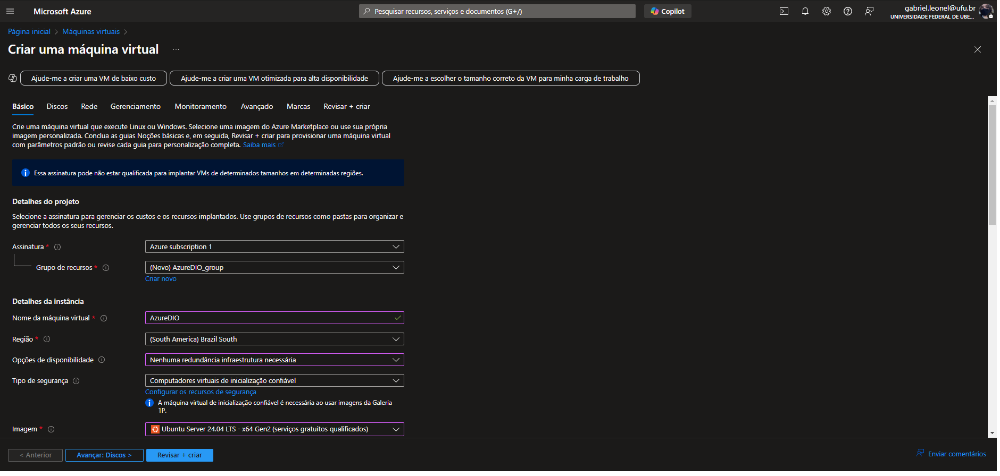
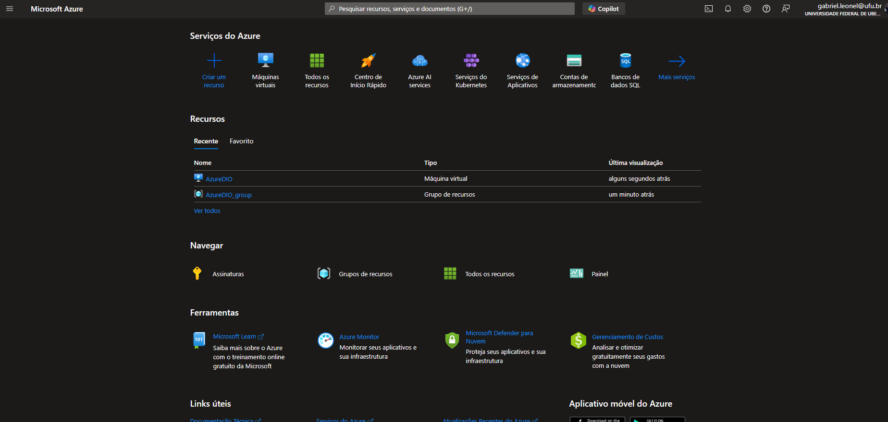

# LabsAzure-DIO
Repo para entrega dos projetos de lab BootCamp Bradesco DIO Azure Cloud

## Conceitos

#### Núvem Privada e Pública
Núvem privada está relacionado a infraestrutura física de uma empresa. Reflete um alto investimento em capital para expansão, pois necessita comprar equipamentos e realizar a instalação
Núvem pública são provedores espalhados ao redor do mundo que oferecem serviços de computação em núvem.

### CapEx e OpEx
CapEx: Gastos relacionado a infraestrutura, expansão vertical.
OpEx: Gastos relacionados a consumo, relacionado a núvem pública

### Service Level Agreement
Configurações de redundância afentam o nível do SLA, de 99% a 99.999%.
Caso o serviço falhe em cumprir o downtime estipulado, será ressarcido uma compensação em créditos na plataforma.

### Tipos de Serviço de nuvem
IaaS – Infrastructure as a Service: Envolve configurações de estrutura, armazenamento. Deve configurar tudo isso, além do sistema operacional, plataforma e software.  
PaaS – Platform as a Service: Ambiente de desenvolvimento, para implantação de serviços. 
SaaS - Software as a Service: Oferece licenças de software (Ex: pacote office)

### Grupos de Recursos
Agrupa máquinas virtuais, armazenamento e bancos de dados em grupos para melhor organização lógica.

# Criação de Máquinas Virtuais

  
Criando Máquina Virtual

  
  

  
Máquina Virtual Criada

  

# Grupos de recurso com VNET

  
Grupo de recursos criado

  
  

  
VNET Criada

  
  

# Inteligência Artificial Azure Cloud
A análise de texto pode ser usada pra extrair palavras chaves, fazendo análise de sentimentos e acontecimentos. 

Azure Cloud A.I disponibiliza diversas ferramentas para isto. 

### Speech Studio
O SpeechToText converte fala em texto em tempo real.

  
Speech To Text

  
  

